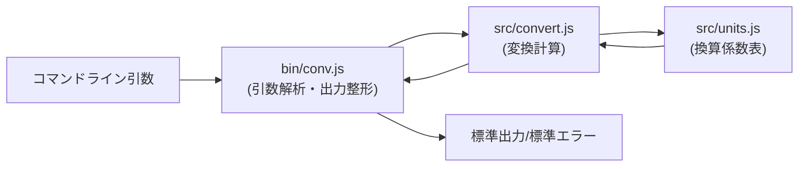

# 構造設計: unit-converter

層: design / 正本: この文書 / 版: 2026-08-16

<!-- devbase/templates/ARCHITECTURE.md v1 準拠(3-C 章立て)。内容は docs/charter.md 3節
     (選定した構造=レイヤード最軽量)と docs/decisions/ADR-001-layered-structure.md の決定を
     実体(bin/・src/ の実在ファイル)に対応づけたもの。 -->

## 0. 手法の一言

入口(CLI引数解析)→ロジック(変換計算)→データ(換算係数)の**一方向レイヤ**。下の層は上の層を
一切知らない(ADR-001)。3ファイルの単機能 CLI に見合う最軽量の構造。

## 1. 何者か(入口)

`unit-converter` は長さ・重さ・温度を変換する Node.js 製 CLI(`conv`)である。選定構造は憲章3節の
とおり**レイヤード(最軽量)**(ADR-001)。エントリポイントは `bin/conv.js`。

## 2. 部品と責務

| 部品(ディレクトリ/モジュール) | 責務 | 依存してよい先 |
|---|---|---|
| `bin/conv.js`(入口層) | 引数解析(`--precision`/`-l`/`-h`)・エラー整形・標準出力 | `src/convert.js`・`src/units.js` |
| `src/convert.js`(ロジック層) | 単位変換の計算(線形換算・温度の個別計算)・`ConversionError` | `src/units.js` のみ |
| `src/units.js`(データ層) | 換算係数表(`LENGTH_TO_METERS`/`MASS_TO_GRAMS`)・カテゴリ判定 | (なし=最内層) |
| `test/convert.test.js` | `src/convert.js` の単体テスト(変換ロジック9件) | `src/convert.js` |
| `test/cli.test.js` | `bin/conv.js` の E2E テスト(CLI 実行・終了コード・出力) | `bin/conv.js`(子プロセスで起動) |

## 3. データの流れ

線の読み方: 実線の往復(B→C→D→C→B)は関数呼び出しの一方向の流れを表す(`convert()` が
`units.js` の表を読んで値を返すだけで、逆方向の副作用は無い)。異常系(未知の単位・カテゴリ
不一致・不正な数値)は `ConversionError` として `src/convert.js`・`bin/conv.js` 側で発生し、
`bin/conv.js` が捕捉して標準エラー+終了コード1へ変換する(R-006)。

## 4. 用語集(ユビキタス言語)

| 用語(日本語) | 英名(コード上の名前) | 意味 |
|---|---|---|
| 変換 | convert | `src/convert.js` の `convert(value, fromUnit, toUnit)`。単位変換の中核関数 |
| カテゴリ | category | 単位の分類(length/mass/temperature)。異なるカテゴリ間の変換はエラー(`categoryOf`) |
| 換算係数表 | conversion table | 各単位を基準単位(メートル/グラム)に換算する係数の定数表 |
| 変換エラー | ConversionError | `src/convert.js` が export する例外クラス。利用者に見せてよいエラーの印 |
| 精度 | precision | 出力の小数点以下桁数(`--precision`。既定4桁。`bin/conv.js` の `formatNumber`) |

## 5. 既知の構造的な負債

無し。`.dependency-cruiser.cjs` は3ファイル規模のため未導入(ADR-001 帰結・憲章6節に
「対象外+理由」を明記)。ファイル数が増えたら導入する。

## 履歴

- 2026-08-16: 起草(A-2 標準適用・最小)。
